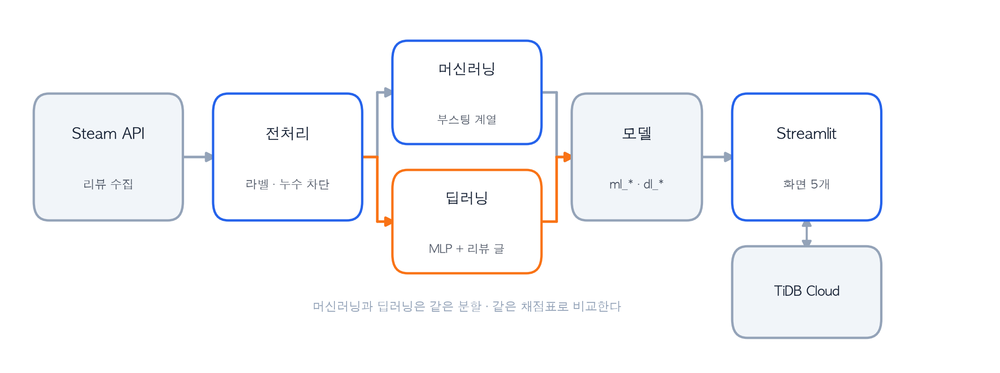

# 1. 팀 소개

## 📌 팀명

<h1 align="center">🎮 SKN35-2nd-2Team : S팀 🎮</h1>

<br />

## 📌 팀 멤버
<div align="center">
  
</div>

<br />

<table>
  <thead>
    <tr>
      <th align="center">차윤정</th>
      <th align="center">이형민</th>
      <th align="center">최우석</th>
      <th align="center">손채영</th>
    </tr>
  </thead>
  <tbody>
    <tr>
      <td align="center"></td>
      <td align="center"></td>
      <td align="center"></td>
      <td align="center"></td>
    </tr>
    <tr>
      <td align="center"><a href="https://github.com/YOONJUNG">@YOONJUNG</a></td>
      <td align="center"><a href="https://github.com/tommylee9068">@tommylee9068</a></td>
      <td align="center"><a href="https://github.com/wsc9150">@wsc9150</a></td>
      <td align="center"><a href="https://github.com/cchhaaee1023">@cchhaaee1023</a></td>
    </tr>
    <tr>
      <td align="center">머신러닝</td>
      <td align="center">데이터 수집·전처리 / 화면</td>
      <td align="center">대장 / 화면 / DB</td>
      <td align="center">딥러닝</td>
    </tr>
  </tbody>
</table>

<!-- TODO: 이름·역할·팀장 표기를 확인해 주세요. 프로필 이미지는 docs/image/ 에 넣습니다 -->

<br />

# 2. 프로젝트 개요

## 📌 프로젝트 명

### 스팀 게임 리뷰 기반 유저 이탈 예측

## 📌 프로젝트 소개

게임 리뷰를 쓴 **그 순간의 정보만으로**, 이 사람이 게임을 계속할지 그만둘지 맞히는 서비스입니다.

스팀 공개 API에서 리뷰를 직접 수집하고, 플레이 시간·보유 게임 수 같은 **행동 기록**과 사용자가 직접 쓴 **리뷰 글**을 함께 학습시켰습니다. 머신러닝(부스팅 계열)과 딥러닝(언어모델 임베딩)을 같은 조건에서 비교하고, 결과를 Streamlit 화면 5개로 제공합니다.

## 📌 프로젝트 필요성(배경)

> **"세일이라서 샀는데, 엔딩도 못 보고 접었어요. 이런 게 한두 개가 아니에요."**

스팀 라이브러리에는 사놓고 안 하는 게임이 쌓여 있습니다. 세일이라서, 평이 좋아서, 친구가 한다고 해서 샀는데 몇 시간 하고 덮어둔 게임들입니다. 환불 기간이 지나면 되돌릴 수도 없습니다.

**유저 입장**

- 게이머가 실제로 하는 계산은 "재밌을까"가 아니라 **"시간당 얼마냐"** 입니다. 같은 값이라도 오래 할 게임과 금방 접을 게임은 체감 가격이 전혀 다릅니다.
- 그런데 **내가 이 게임을 얼마나 할 사람인지**는 사보기 전에 알 수 없습니다. 평점과 리뷰는 남의 이야기지 내 이야기가 아닙니다.
- 사기 전에 알 수 있다면 낭비를 줄일 수 있습니다.

**게임사 입장**

- 신규 유저를 모으는 것만큼 **이미 산 사람이 계속하게 만드는 일**이 중요합니다.
- 그런데 게임마다 사람을 잃는 지점이 다릅니다. **초반에 잃는 게임과 후반에 잃는 게임은 처방이 갈립니다.** 앞은 튜토리얼과 진입 난이도, 뒤는 콘텐츠 분량 문제입니다.
- 어떤 유저가 언제 떠나는지 알 수 있다면, 어디를 손봐야 하는지도 정해집니다.

## 📌 프로젝트 목표

1. 비즈니스 문제를 이해하고 이탈 예방을 위한 머신러닝 활용 계획을 수립합니다.
2. 스팀 공개 API로 데이터를 직접 수집하고, 정답(라벨)을 정의·검증합니다.
3. 데이터 누수를 차단하고 전처리·특징공학을 수행합니다.
4. 머신러닝 5종을 학습·튜닝하고 최적 모델을 선정합니다.
5. 딥러닝으로 리뷰 글을 학습시켜 **"글이 예측에 도움이 되는가"** 를 검증합니다.
6. 두 가지 분할(랜덤 / 게임 단위)로 평가해 **모델이 게임 이름을 외웠는지** 확인합니다.
7. Streamlit과 TiDB Cloud를 연동해 예측 결과를 체험할 수 있는 화면을 구현합니다.

## 📌 데이터 소개

### 1) 데이터 출처

- 출처: [Steam 리뷰 공개 API](https://partner.steamgames.com/doc/store/getreviews) — API 키·회원가입 불필요
- 수집: 2026-08-25 07:30 UTC · 게임 60개 × 리뷰
- 크기: **139,667행 × 28컬럼** · 30개 언어 · 결측 없음

**게임 60개 선정 기준** — 장르 / 출시시기 / 평가등급 / 가격 / 리뷰 볼륨 5개 축으로 격자를 만들어 골고루 뽑았습니다. 리뷰가 너무 많은 초대형 게임(CS2 등)은 6개월 전 데이터에 도달할 수 없어 제외했습니다.

### 2) 정답(라벨) 정의

```
리뷰 후 추가 플레이 = 지금까지 총 플레이 − 리뷰 쓸 때까지 플레이

  1시간 미만  →  이탈 (1)
  1시간 이상  →  잔존 (0)

단, 리뷰를 쓴 지 180일 이상 지난 것만 사용
```

180일 기준은 데이터가 정했습니다. 최근 리뷰일수록 이탈률이 부풀려지는데(0~30일 46.6%), 180일을 넘기면 평평해집니다.

### 3) 전처리 데이터

전처리 결과는 `data/processed/dataset.csv`로 저장합니다. **139,658행 × 30컬럼**, 이탈률 **41.1%**.

- 물리적으로 불가능한 행 9건 제거 (추가 플레이가 음수)
- **보유 게임 수 0 (51.5%)** → 실제로는 프로필 비공개. `is_private` 플래그로 분리
- 리뷰 길이를 **언어별로 보정** (한국어 15자 = 영어 57자)
- **데이터 누수 컬럼 8개 제거** — 리뷰 작성 시점 이후의 정보

<br />

# 3. 기술 스택

<table>
  <tr>
    <th>Frontend</th>
    <td> </td>
  </tr>
  <tr>
    <th>Backend &amp; DB</th>
    <td>  </td>
  </tr>
  <tr>
    <th>Machine Learning</th>
    <td>     </td>
  </tr>
  <tr>
    <th>Deep Learning</th>
    <td>   </td>
  </tr>
  <tr>
    <th>Infra &amp; 협업</th>
    <td>   </td>
  </tr>
</table>

<br />

# 4. 시스템 아키텍처

<div align="center">
  
</div>

## 📌 데이터 흐름

1. **수집** — 스팀 공개 API에서 게임 60개의 리뷰를 커서 방식으로 받습니다. 스팀은 요청 시점의 플레이 시간을 돌려주므로, **한 사람이 한 번만 수집**하고 수집 일시를 함께 기록합니다.
2. **전처리** — `preprocess.py`가 라벨을 만드는 유일한 곳입니다. 누수 컬럼 8개를 제거하고 학습 직전 자동 검사를 겁니다.
3. **학습** — 머신러닝과 딥러닝이 **같은 분할·같은 채점표**(`evaluate.py`)를 씁니다. 각자 나누면 비교가 무의미해집니다.
4. **서비스** — 화면은 `src/predict.py` 하나만 호출합니다. 화면에서 모델을 직접 부르면 전처리가 학습 때와 어긋납니다.

<br />

# 5. ERD

<!-- TODO: ERD 그림을 docs/image/ 에 넣고 아래 주석을 푸세요 -->

<br />

# 6. 폴더구조

```text
SKN35-2nd-2Team/
├── src/            머신러닝·딥러닝 학습, 전처리, 예측 코드
├── app/            Streamlit 화면 5개
├── data/           raw(원본) · processed(학습용) · embeddings(임베딩)
├── models/         학습된 모델 — ml_*(머신러닝) · dl_*(딥러닝) · shap_*(설명)
├── results/        실험 기록 65건 · 하이퍼파라미터 탐색 로그
├── reports/        결과서·발표에 쓰는 그림
├── docs/           전처리 결과서 · 학습 결과서
├── db/             TiDB 스키마 및 적재 스크립트
├── notebooks/      코랩 실험 노트북
├── pyproject.toml  패키지 목록 (uv)
└── uv.lock         버전 고정 — 팀 전원 동일 환경
```

`data/` 의 CSV와 `.npy` 는 용량 때문에 깃에서 제외합니다. 코드로 다시 만들 수 있습니다.

## 📌 실행 방법

```bash
uv sync                              # 파이썬 3.12 + 패키지 (맥·윈도우 동일)
uv run python -m src.preprocess      # 원본 → 학습용 데이터
uv run streamlit run app/main.py     # 화면 실행
```

<br />

# 7. 수행결과

## 📌 모델 성능

영어 리뷰 67,112건 기준. **두 가지 분할로 평가**했습니다.

| 모델 | 랜덤 분할 | 게임 단위 분할 |
|---|---|---|
| 로지스틱 회귀 | 0.767 | 0.711 |
| **랜덤포레스트** | 0.814 | **0.757** |
| XGBoost | 0.810 | 0.745 |
| LightGBM (배포본) | 0.813 | 0.742 |
| MLP (숫자만) | 0.807 | 0.706 |
| MLP (숫자 + 글) | 0.786 | 0.730 |
| **AutoGluon multimodal** | 0.807 | **0.759** |

**게임 단위 분할**은 학습에 없던 게임으로 시험을 봅니다. 게임마다 이탈률이 9%~89%로 달라, 모델이 게임 이름만 외워도 랜덤 분할에서는 잘 나오기 때문입니다.

> **정확도(accuracy)는 쓰지 않습니다.** 이탈률이 41%라 아무것도 안 하고 "전부 잔존"이라고만 찍어도 59%가 나옵니다.

## 📌 주요 발견

**① 글만 봐도 맞힌다** — 플레이 시간을 주지 않고 리뷰 글만으로 AUC **0.705** (동전 던지기 0.5)

**② 그런데 숫자에 더해도 안 오른다** — 0.813 → 0.807. 글이 아는 걸 숫자가 이미 알고 있습니다.
글만으로 추천/비추천(👍)을 **AUC 0.939**로 맞히는데, 그건 이미 입력에 있기 때문입니다.

**③ 처음 보는 게임에서는 글이 이긴다** — 0.750 → 0.759

> `Trailmakers`에서 10시간은 초보, `Half-Life`에서 10시간은 클리어입니다. **같은 숫자인데 뜻이 정반대**라 새 게임으로 안 옮겨갑니다. 반면 **"환불함"은 어느 게임에서든 환불함**입니다.
>
> **숫자는 그 게임 안에서 정확하고, 말은 게임을 건너뛰어도 통합니다.**

**④ 천장은 데이터 양이 아니었다** — 학습 곡선이 마지막 구간에서 +0.002로 평평해졌고, 데이터를 2.1배로 늘려도 성능이 같았습니다. 자동화 도구(AutoGluon)도 같은 지점에서 멈췄습니다.

## 📌 산출물

| | |
|---|---|
| 인공지능 데이터 전처리 결과서 | [docs/01_전처리결과서.md](docs/01_전처리결과서.md) · [PDF](docs/01_전처리결과서.pdf) |
| 인공지능 학습 결과서 (딥러닝) | [docs/학습결과서_딥러닝.md](docs/학습결과서_딥러닝.md) |
| 인공지능 학습 결과서 (머신러닝) | [docs/학습결과서_머신러닝.md](docs/학습결과서_머신러닝.md) · [PDF](docs/학습결과서_머신러닝.pdf) |
| 학습된 인공지능 모델 | [`models/`](models/) |

<br />
