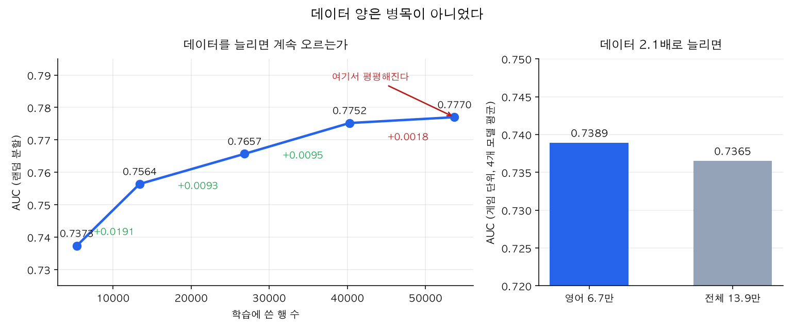

# 학습 결과서 — 딥러닝 파트

**데이터** 전처리 v1.2 · **작성** 2026-08-27

---

## 한 장 요약

우리가 알고 싶었던 것은 딱 하나입니다.

> **"사람이 쓴 리뷰 글이, 그 사람이 게임을 그만둘지 맞히는 데 도움이 되는가?"**

답은 이렇습니다.

| 질문 | 답 |
|---|---|
| 글에 신호가 있나? | **있다.** 글만 봐도 AUC 0.70 |
| 그럼 숫자에 글을 더하면 오르나? | **거의 안 오른다.** 0.813 → 0.810 |
| 글을 더 잘 읽히면? | **두 분할 모두 +0.030.** 아는 게임에선 숫자를 못 넘지만(0.807<0.813), **처음 보는 게임에선 넘는다**(0.759>0.750) |
| 왜 안 오르나? | 글이 아는 걸 **숫자가 이미 알고 있어서** |
| 그럼 글은 쓸모없나? | **아니다.** 처음 보는 게임에서는 글이 이긴다 |
| 모델은 뭘 보고 판단하나? | 글 > 장르 > 추천여부 > 리뷰 수 > 플레이 시간 (SHAP) |
| 자동화 도구가 더 잘하나? | **아니다.** 랜덤 0.813 vs 0.813, 게임분할 0.762 vs 0.757 — 사실상 동일 |
| 데이터가 부족한 건 아닌가? | **아니다.** 학습 곡선이 평평해졌고, 2.1배로 늘려도 성능이 같았다 |
| 글이 왜 도움이 안 됐나? | 글의 핵심 정보가 **추천/비추천(👍)** 인데, 그건 이미 입력에 있다 (글→추천 AUC 0.939) |
| 그럼 글은 무시되나? | **아니다.** 개별 예측은 최대 81%p 움직인다. 다만 순서를 안 바꿔서 AUC 가 안 오른다 |
| 화면에 뜨는 확률을 믿어도 되나? | 확률 보정을 씌워 오차를 절반으로 줄였다 (ECE 0.035 → 0.018) |

**한 줄로:** 숫자는 그 게임 안에서 정확하고, **말은 게임을 건너뛰어도 통합니다.**

---

## 1. 무엇을 재려고 했나

머신러닝 담당(B)은 **숫자만** 봅니다 — 플레이 시간, 보유 게임 수, 장르 같은 것들.

딥러닝 담당(C)은 **거기에 글을 더합니다.** 두 성능을 비교하면 글의 값어치가 나옵니다.

```
숫자만        →  ?
숫자 + 글     →  ?
              ─────
      차이가 곧 "글의 효과"
```

### 왜 영어만 썼나

리뷰는 30개 언어로 쓰여 있습니다. 전부 넣으면 모델이 **글은 안 읽고 언어만 보는 지름길**을 탑니다 — "이건 러시아어네 → 그 게임이네 → 안 떠나겠네" 하는 식으로요.

그래서 가장 많은 영어(**67,112행**)만 썼습니다. 영어만 써도 이탈률 차이가 0.9%p 뿐이라 데이터가 크게 치우치지 않습니다.

### 공정하게 비교하기

B가 낸 숫자(AUC 0.820)는 **13.9만 행 전체** 기준입니다. 우리는 6.7만 행만 씁니다.

행 수가 다르면 **글 덕분에 이긴 건지 데이터가 많아서 이긴 건지 알 수 없습니다.**
그래서 숫자만 쓰는 모델도 **영어 6.7만 행에서 처음부터 다시** 측정했습니다.

---

## 2. 두 가지 시험을 봅니다

| 시험 | 어떻게 나누나 | 무엇을 재나 |
|---|---|---|
| **랜덤 분할** | 6.7만 행을 섞어서 8:2 | **아는 게임**에서의 실력 |
| **게임 단위 분할** | 게임 60개를 5조각. 학습에 없던 게임으로 시험 | **처음 보는 게임**에서의 실력 |

두 번째가 중요합니다. 게임마다 이탈률이 9%~89%로 천차만별이라, 모델이 **"아 이거 그 게임이네"** 하고 이름만 외워도 첫 번째 시험은 잘 봅니다.

**두 점수의 차이 = 모델이 게임을 얼마나 외웠나.** 이 문서에서는 그걸 **낙폭**이라고 부릅니다.

> **정확도(accuracy)는 쓰지 않습니다.** 영어 데이터의 이탈률이 40.2%라, 아무것도 안 하고 전부 "안 떠난다"고만 찍어도 정확도 59.8%가 나옵니다. 대신 AUC를 씁니다 — 이탈한 사람과 안 떠난 사람을 하나씩 뽑았을 때 모델이 이탈자에게 더 높은 점수를 줄 확률입니다. 0.5는 동전 던지기, 1.0은 완벽.

---

## 3. 결과

| 모델 | 입력 | 랜덤 분할 | 게임 단위 | 낙폭 |
|---|---|---|---|---|
| 로지스틱 | 숫자만 | 0.767 | 0.712 ± 0.044 | −0.055 |
| **부스팅** | 숫자만 | **0.813** | 0.750 ± 0.041 | −0.063 |
| MLP | 숫자만 | 0.807 | 0.706 ± 0.062 | **−0.101** |
| MLP | **글만** | 0.705 | 0.661 ± 0.027 | **−0.044** |
| MLP | 숫자+글 | 0.777 | 0.730 ± 0.028 | −0.048 |
| **부스팅** | 숫자+글 | 0.810 | **0.757 ± 0.041** | −0.053 |


---

## 4. 읽는 법 — 발견 세 가지

### 발견 ① 글만 봐도 맞힌다

플레이 시간도, 보유 게임 수도 안 주고 **글만** 줬는데 AUC **0.705**가 나왔습니다. 동전 던지기(0.5)보다 훨씬 위입니다.

**"재밌어요"와 "환불함"은 실제로 다른 신호입니다.**

### 발견 ② 그런데 숫자에 더하면 안 오른다

```
부스팅  숫자만    0.813
부스팅  숫자+글   0.810   ← 오히려 아주 살짝 낮음
```

**글이 아는 걸 숫자가 이미 알고 있기 때문입니다.**

생각해보면 당연합니다. 30분 하고 "환불함"이라고 쓴 사람은 — **글을 안 읽어도 "30분"이라는 숫자가 이미 다 말해줍니다.**

> **단, 여기엔 단서가 붙습니다.** 위 실험은 **미리 뽑아둔 임베딩을 고정**해서 쓴 결과입니다.
> 나중에 언어모델을 우리 문제에 맞게 재학습해보니 **+0.030 올랐습니다**(7절).
> 즉 글을 덜 활용하고 있었던 것도 맞습니다.
> 다만 그렇게 끌어올려도 숫자만 쓴 모델(0.813)을 넘지는 못했습니다.

### 발견 ③ 처음 보는 게임에서는 글이 이긴다 ← **가장 중요**


| | 랜덤 분할 | 게임 단위 |
|---|---|---|
| 부스팅 숫자만 → 숫자+글 | 0.813 → 0.810 **(−0.003)** | 0.750 → 0.757 **(+0.006)** |
| MLP 숫자만 → 숫자+글 | 0.807 → 0.777 **(−0.030)** | 0.706 → 0.730 **(+0.024)** |

**아는 게임에서는 글이 도움이 안 되는데, 처음 보는 게임에서는 도움이 됩니다.**

낙폭을 보면 이유가 보입니다.

```
글만        −0.044   ← 가장 적게 떨어짐
숫자+글     −0.048
로지스틱     −0.055
부스팅 숫자만 −0.063
MLP 숫자만  −0.101   ← 가장 많이 떨어짐
```

**왜 그럴까요.**

숫자는 게임마다 뜻이 다릅니다. `Trailmakers`에서 10시간은 이제 막 시작한 사람이고, `Half-Life: Blue Shift`에서 10시간은 게임을 다 깬 사람입니다. **같은 "10시간"인데 뜻이 정반대**입니다. 그래서 숫자로 배운 규칙은 새 게임으로 잘 안 옮겨갑니다.

말은 다릅니다. **"환불함"은 어느 게임에서든 환불함입니다.**

> ### 발표 한 줄
> **숫자는 그 게임 안에서 정확하고, 말은 게임을 건너뛰어도 통한다.**

### 곁다리 두 가지

- **신경망이 게임을 제일 많이 외웁니다.** MLP(숫자만)의 낙폭이 −0.101 로 전 모델 중 최악입니다(부스팅 −0.063). 아는 게임에서는 비슷해 보여도 처음 보는 게임에서 훨씬 크게 무너집니다.
- **검열된 욕설이 신호가 됐습니다.** `has_repeat`(같은 글자 4번 이상)이 `♥♥♥♥` `****` 같은 **스팀의 욕설 검열 자국**까지 잡았습니다. 이 변수가 1인 리뷰의 이탈률은 44.9%, 아닌 쪽은 39.9% 입니다.

---

## 5. 딥러닝이 부스팅에 졌습니다 — 괜찮습니다

```
부스팅  0.813   >   MLP  0.807
```

> **덧붙임** — 나중에 AutoGluon multimodal 로 언어모델까지 재학습해 봤지만
> (0.807) 역시 부스팅(0.813)을 넘지 못했습니다. 신경망을 제대로 쓴 결과입니다(7절).

**표 형태 데이터에서 부스팅이 신경망을 이기는 것은 널리 알려진 결과입니다.** 과제가 요구한 것은 "딥러닝이 이겨라"가 아니라 **"둘을 같은 조건에서 비교하고 근거를 갖고 골라라"** 입니다.

다만 **글을 넣는 순간 이야기가 달라집니다.** 글은 부스팅이든 신경망이든 넣을 수 있고, 넣었을 때 처음 보는 게임에서 둘 다 올랐습니다. 그게 이 파트의 성과입니다.

---

## 6. 모델은 무엇을 보고 판단하나 (SHAP)

모델은 **"이탈 확률 0.87"** 만 뱉습니다. 왜 0.87인지는 알려주지 않습니다.

**SHAP**은 그 0.87을 변수별 몫으로 쪼갭니다.

```
기본값 0.40      아무것도 모를 때의 평균 이탈률
  + 0.31   플레이 시간이 25분밖에 안 됨
  + 0.09   리뷰 글의 내용
  + 0.05   비추천을 누름
  - 0.02   보유 게임이 적음
─────────
  = 0.83   이 사람의 이탈 확률
```

각 몫은 **"그 변수를 몰랐다면 확률이 얼마나 달랐을까"** 를 잰 값입니다.


> **이 그림이 설명하는 대상에 주의.** 최종 모델은 신경망(MLP)인데,
> 이 그림은 **같은 데이터로 따로 학습한 LightGBM** 의 변수 중요도입니다.
> 신경망의 SHAP 은 근사값이라 느려서 트리 모델로 계산했습니다(아래 참조).
> **MLP 의 출력을 흉내 낸 대리 모델이 아닙니다** — 같은 정답으로 학습한 별개 모델이고,
> 실제로 성능이 더 좋습니다(0.812 vs 0.777). "어떤 변수가 대체로 중요한가" 를
> 보는 용도로만 읽어야 합니다.

| 변수 | 평균 기여도 |
|---|---|
| **리뷰 글** (64개 성분의 합) | **0.921** |
| 장르 | 0.385 |
| 추천 / 비추천 | 0.372 |
| 작성한 리뷰 수 | 0.292 |
| 플레이 시간 | 0.247 |
| 게임 평가 등급 | 0.223 |

### ⚠️ 헷갈리기 쉬운 곳 — 글이 1위인데 왜 빼도 되나

앞에서 **"글을 빼도 성능이 안 떨어진다"** 고 했는데, 여기서는 글이 1위입니다. 모순처럼 보이지만 **서로 다른 것을 재고 있습니다.**

| | 재는 것 |
|---|---|
| **SHAP** | 모델이 그 변수를 **얼마나 쓰는가** |
| **AUC 비교** | 그 변수가 **없으면 성능이 얼마나 떨어지는가** |

모델은 글을 많이 씁니다. 그런데 글을 빼도 성능이 안 떨어집니다 — **숫자가 대신 채워주기 때문**입니다.

> 시계와 휴대폰을 둘 다 갖고 다니면서 시간은 주로 시계로 봅니다(SHAP 높음).
> 그런데 시계를 잃어버려도 곤란하지 않습니다 — 휴대폰이 있으니까요(AUC 안 떨어짐).

### 두 번째 증거 — 글은 개별 예측을 최대 81%p 움직인다

"글이 SHAP 1위인데 왜 빼도 되나" 를 다른 방법으로도 확인했습니다.

**숫자 조건을 완전히 고정한 채, 진짜 리뷰 300개를 갈아 끼워** 확률이 얼마나 움직이는지 쟀습니다.

| 고정한 숫자 조건 | 확률 범위 | 폭 |
|---|---|---|
| 25분 · 추천 | 0.146 ~ 0.960 | **81.4%p** |
| 600분 · 추천 | 0.114 ~ 0.907 | 79.3%p |
| 18000분 · 추천 | 0.046 ~ 0.852 | 80.6%p |

*(참고: 글을 고정하고 추천/비추천만 뒤집으면 25%p)*

**글은 추천/비추천보다도 크게 예측을 흔듭니다.** 그런데도 글을 빼면 AUC 는 0.006 밖에 안 떨어집니다.

```
글이 확률을 0.15 -> 0.96 으로 올린다
그런데 숫자(25분)가 이미 같은 방향을 가리키고 있었다
-> 순서가 안 바뀐다 -> AUC 가 안 오른다
```

**"크게 움직인다" 와 "잘 맞힌다" 는 다릅니다.** AUC 는 순서만 보기 때문입니다.

> 이 측정은 화면 담당의 지적에서 출발했습니다. 저희가 처음 문장 2개로만 재서
> "1.7%p 밖에 안 움직인다" 고 잘못 판단했고, 리뷰 300개로 다시 재서 바로잡았습니다.

### 근거는 왜 다른 모델로 계산하나

신경망의 SHAP 은 근사값이라 한 건에 몇 초가 걸려 화면에서 못 씁니다.
트리 모델(LightGBM)은 정확한 값을 2,000건에 0.3초에 계산하고, 같은 입력에 성능도
거의 같아(0.812 vs 0.777) "어떤 변수가 중요한가" 의 답은 공유됩니다.

**확률은 최종 모델이 내고, 근거만 이 모델이 만듭니다.**

---

## 7. 자동화 도구와 비교 (AutoGluon)

우리가 손으로 만든 모델이, **자동으로 다 해주는 도구**보다 나은지 확인했습니다.

AutoGluon은 데이터를 던지면 알아서 여러 모델을 만들고 조합해줍니다. 사람이 고민한
피처 엔지니어링과 모델 선택이 값어치가 있었는지를 재는 기준이 됩니다.

### 두 가지를 서로 다른 곳에서 돌렸습니다

| 실험 | 재료 | 어디서 | 왜 |
|---|---|---|---|
| **tabular** | 숫자 24개 + 임베딩 PCA 64 | 맥 (로컬) | 트리 모델이라 **원래 CPU가 정상** |
| **multimodal** | 숫자 24개 + **리뷰 원문** | 코랩 GPU | 언어모델 재학습이라 **GPU가 필요** |

**왜 나눴나** — AutoGluon 은 **CUDA 만 GPU 로 인식합니다.** 맥의 MPS 는 아예 보지 않아
`gpus=0` 으로 돕니다. tabular 은 트리 계열이라 GPU 가 필요 없어 맥에서 5분,
multimodal 은 언어모델 파인튜닝이라 맥 CPU 로 3~6시간 · 코랩 T4 로 20~40분입니다.

### 결과 — tabular

| 모델 | 랜덤분할 | 게임 단위 | 낙폭 |
|---|---|---|---|
| 우리 부스팅 (숫자만) | 0.813 | 0.750 ± 0.041 | −0.063 |
| 우리 부스팅 (숫자+글) | 0.810 | 0.757 ± 0.041 | −0.053 |
| **AutoGluon (숫자+글)** | **0.813** | **0.762 ± 0.041** | −0.051 |

**사실상 같습니다.**

```
랜덤 분할    우리 0.810  vs  AutoGluon 0.813    차이 +0.003
게임 단위    우리 0.757  vs  AutoGluon 0.762    차이 +0.005   (편차 ±0.041 안)
```

낙폭(−0.053 vs −0.051)까지 거의 같습니다. **같은 재료를 주면 같은 곳에 도달한다**는 뜻입니다.

> **읽는 법** — 여러 모델을 자동으로 만들고 조합해주는 도구를 써도
> 우리가 손으로 만든 것보다 나아지지 않았습니다.
> **성능의 상한은 모델 선택이 아니라 데이터가 정하고 있었습니다.**
> 바꿔 말하면, 우리 피처 엔지니어링이 이 데이터에서 뽑을 만큼 뽑았다는 뜻입니다.

### 결과 — multimodal (코랩)

리뷰 **원문**을 언어모델에 직접 읽히면, 미리 뽑아둔 고정 임베딩보다 나은가?

| 모델 | 글을 다루는 방식 | 랜덤분할 | 게임 단위 |
|---|---|---|---|
| MLP (숫자+글) | 미리 뽑은 임베딩 **고정** | 0.777 | 0.730 ± 0.028 |
| **AutoGluon (multimodal)** | 언어모델을 **재학습** | **0.807** | **0.759 ± 0.046** |
| 우리 부스팅 (숫자만) | 글을 아예 안 씀 | 0.813 | 0.750 ± 0.041 |


**세 가지가 한꺼번에 나왔습니다.**

1. **고정 임베딩은 글을 덜 활용하고 있었습니다.** 랜덤·게임 단위 **양쪽 모두 +0.030** —
   폭이 정확히 같아 우연이 아닙니다. 4절의 "글을 더해도 안 오른다" 는
   일부는 임베딩을 고정한 탓이었습니다.
2. **아는 게임에서는 여전히 숫자를 못 넘었습니다.** 0.807 < 0.813 (−0.006)
3. **처음 보는 게임에서는 넘었습니다.** 0.759 > 0.750 (+0.009). 낙폭도 −0.048 로
   숫자만 쓴 부스팅(−0.063)보다 작아, **4절 발견 ③ 이 가장 좋은 텍스트 모델에서도
   그대로 재현**됐습니다.

> **이 실험이 값어치 있었던 이유** — 이 결과가 없었다면
> **"임베딩을 대충 써서 안 오른 것 아니냐"** 는 반박에 답할 수 없었습니다.
> 이제 답할 수 있습니다:
>
> **글을 가장 잘 읽는 방법으로 읽혀도, 아는 게임에서는 숫자를 못 넘었다.**
> **다만 처음 보는 게임에서는 글이 이겼다 — 그 방향은 더 뚜렷해졌다.**

**측정 조건** — 코랩 T4 GPU, 조각당 30분 제한, 영어 67,112행, 5조각(총 2.6시간).

### 부딪힌 문제 다섯 가지

같은 환경에서 다시 돌릴 사람을 위해 기록해둡니다.

| 문제 | 어떻게 |
|---|---|
| **프로세스가 조용히 멈춤** — LightGBM 을 먼저 로드하면 AutoGluon 이 멀티프로세싱에서 교착. **예외 없이 CPU 0% 로 무한 대기** | LightGBM 선점을 `config.py` 에서 빼고 `explain_dl.py` 에서만 하도록 이동 |
| **맥 GPU 를 못 씀** — CUDA 만 인식 | multimodal 은 코랩 T4 로 |
| **메모리 부족** — 여유 0.7GB 라 AutoGluon 이 스스로 모델을 깎음(`n_estimators 300→222`) | 결과에 조건 명시. 제한이 없었다면 조금 더 높았을 수 있음 |
| **결과가 깃 정리 중 유실** — 3,000행짜리 예비 실행 결과를 본 실험으로 착각할 뻔함 | `행수` 열 덕에 발견. 재실행해 정정. **결과에는 표본 크기를 항상 같이 남긴다** |
| **임베딩 정렬 어긋남** — 표본을 줄인 뒤 읽으면 행이 안 맞음 | `embed.load()` 의 정렬 검사가 에러로 막아줌. 줄이기 **전에** 읽도록 수정 |

> 첫 번째가 가장 무서웠습니다. **오류가 나지 않고 그냥 안 끝납니다.**
> 밤새 돌려두면 아침에 아무 결과도 없습니다. 긴 작업 전에는
> 반드시 작은 표본으로 먼저 돌려봐야 한다는 교훈입니다.
> (`uv run python -m src.auto --mode smoke` 를 그래서 만들었습니다.)

---

### 덧붙임 — 글의 기여가 작았던 진짜 이유

화면 담당이 돌려본 실험을 직접 재현했습니다. 같은 조건에서 글 다루는 방식만 바꾸면 —

| 글을 다루는 방식 | 글의 기여 |
|---|---|
| 뜻을 이해하는 **임베딩** (우리가 쓴 것) | +0.006 |
| **단어를 세는 TF-IDF** | **+0.015** |

단어를 세는 쪽이 2.3배 나았습니다. 그런데 **둘 다 작습니다.** 이유는 이겁니다.

```
글만으로 추천/비추천(👍) 맞히기   AUC 0.939
글만으로 이탈 맞히기              AUC 0.705
```

**글이 가진 가장 강한 정보는 "만족했는가" 인데, 그건 👍 버튼이 이미 말해줍니다.**
4절에서 "글이 아는 걸 숫자가 이미 알고 있다" 고 한 그 숫자의 정체가 `voted_up` 이었습니다.

TF-IDF 가 더 나았지만 채택하지 않았습니다. 이 파트의 질문은 **"언어모델이 글을 읽으면
도움이 되는가"** 인데 TF-IDF 는 단어 세기라 질문이 바뀌고, +0.015 는 게임 단위 분할
편차(±0.04) 안입니다.

---

## 8. 최종 모델

**고른 것** — `MLP (숫자 + 글 64차원)`

**고른 기준** — **게임 단위 분할 성능.** 실제 서비스에서는 학습에 없던 게임의 리뷰가 들어옵니다. 랜덤 분할 점수는 "이미 아는 게임에서의 실력"이라 실전과 다릅니다.

| | |
|---|---|
| 랜덤 분할 | **0.786** (확률 보정 후) |
| 게임 단위 | **0.730** |
| 이탈 판정 기준 | 확률 **0.326** 이상 |
| 확률 보정 | sigmoid (`CalibratedClassifierCV`, cv=5) |

### 확률 보정을 씌운 이유

화면 1 이 확률을 **큰 숫자로** 보여줍니다. 순위만 맞으면 되는 AUC 와 달리,
**"85%" 라고 쓰면 실제로 85% 여야** 합니다.

확인해보니 모델이 확률을 가운데에서 바깥으로 밀어내고 있었습니다.
높은 쪽은 부풀리고(0.7~0.8 구간: 예측 0.750 vs 실제 0.662) 낮은 쪽은 깎았습니다.
**평균은 맞았고**(전체 예측 0.411 / 실제 0.402) 기울기가 틀린 문제였습니다.

`CalibratedClassifierCV(method="sigmoid", cv=5)` 를 씌운 결과입니다.

| | 보정 전 | 보정 후 |
|---|---|---|
| **확률 오차(ECE)** | 0.0352 | **0.0161** |
| AUC | 0.7770 | 0.7861 |
| Brier | 0.1873 | 0.1823 |

**오차가 절반으로 줄었고 AUC 는 오히려 올랐습니다.** 보정은 확률의 눈금만 바꾸고
순서는 안 바꾸므로 AUC 가 떨어지지 않습니다.
`cv` 3·5·10 과 isotonic 을 비교해 cv=5 sigmoid 를 골랐습니다(ECE·AUC·Brier 모두 1등).

### 보정 후에도 남는 한계

| 구간 | 비중 | 오차 |
|---|---|---|
| 0.0 ~ 0.2 | 24% | +0.025 |
| **0.2 ~ 0.8** | **68%** | **±0.005** ✅ |
| 0.8 ~ 1.0 | 6% | **−0.056** |

**0.2~0.8 은 거의 정확하고 0.8 이상은 여전히 과소평가입니다.**
sigmoid 는 파라미터가 `a`, `b` 두 개뿐이라 S자 하나로 전 구간을 맞춰야 합니다.
가운데를 맞추면 양 끝이 틀어지는 **구조적 한계**이지 설정 실수가 아닙니다.

> **화면 표기 권장** — 0.2~0.8 은 숫자를 그대로, 0.8 이상은 "매우 높음",
> 0.2 미만은 "낮음" 처럼 구간으로 보여주는 편이 안전합니다.
> *(이 문제는 화면 담당이 발견했습니다.)*

> **왜 0.5 가 아니라 0.326 인가** — 0.5 로 자르면 F1 이 0.635, 0.326 이면 0.669 입니다.
> 이탈자가 40% 뿐이라 기준을 낮춰야 놓치는 사람이 줄어듭니다.
> 이 기준은 **학습에 쓰지 않은 데이터**에서 골랐습니다.

### 화면 담당에게 넘기는 것

```
models/dl_model.joblib         모델 (전처리까지 통째로 들어 있음)
models/dl_threshold.json       이탈 판정 기준 0.326
models/dl_feature_order.json   ★ 열 순서
models/dl_meta.json            어떤 데이터로 만들었는지
```

**`dl_feature_order.json`이 가장 중요합니다.** 모델은 열을 **이름이 아니라 순서로** 받습니다. 순서가 하나만 어긋나도 **에러 없이 조용히 틀린 답**이 나옵니다.

화면에서는 모델을 직접 부르지 말고 `src/predict.py`의 함수 하나만 쓰면 됩니다.

```python
from src.predict import predict_one
predict_one(review="...", playtime_at_review_min=25, ...)
# -> {"이탈확률": 0.707, "판정": "이탈"}
```

**실제로 넣어본 예** (확률 보정 후)

| 리뷰 | 플레이 | 결과 |
|---|---|---|
| "Refunded after 30 minutes. Total waste of money." | 25분 | **이탈 0.707** |
| "300 hours in and still playing with friends every night." | 300시간 | 잔존 0.278 |
| "fun" | 90분 | **이탈 0.623** |

세 번째가 재밌습니다. 글은 긍정적인데(`fun`) **90분밖에 안 했다는 숫자가 이겼습니다.**
발견 ②를 눈으로 보여주는 사례입니다.

---

## 9. 한계 — 솔직하게

| 한계 | 내용 |
|---|---|
| **영어만** | 30개 언어 중 영어(48%)만 썼습니다. **다만 데이터 양이 병목은 아니었습니다 — 아래 참조.** 다른 언어에서도 같은 결론일지는 확인하지 않았습니다 |
| **리뷰 쓴 사람만** | 애초에 리뷰를 쓴 사람만 데이터에 있습니다. 조용히 떠난 사람은 알 수 없습니다 |
| **게임 60개** | 다른 60개를 골랐으면 숫자가 달라질 수 있습니다 |
| **조각별 편차** | 게임 단위 분할은 조각마다 크게 흔들립니다(±0.03~0.06). 그래서 평균과 편차를 함께 적었습니다 |
| **`is_spike` 차이** | 학습 때는 "리뷰가 몰린 날인가"를 쓰는데, 화면에서는 알 수 없어 항상 0으로 넣습니다. 실제 화면 성능은 위 숫자보다 조금 낮을 수 있습니다 |
| **글 길이 잘림** | 임베딩 모델이 긴 글은 앞부분만 읽습니다. 3,000자 넘는 리뷰는 뒷부분이 반영되지 않습니다 |
| **근거 모델이 다름** | 확률은 신경망이 내고 근거(SHAP)는 트리 모델이 만듭니다. 두 모델의 성능이 거의 같아 결론은 공유되지만, 개별 리뷰에서 근거와 확률이 미세하게 어긋날 수 있습니다 |
| **글 기여도의 해석** | SHAP에서 글이 1위지만, 이는 "모델이 많이 쓴다"는 뜻이지 "없으면 안 된다"는 뜻이 아닙니다 (6절 참조) |
| **확률 보정 후에도 구간별 오차는 남음** | 전체 ECE 는 절반으로 줄었지만, 0.8 이상 구간은 −0.056 으로 이번엔 과소평가입니다 |
| **AutoGluon 은 메모리 제약 하에 측정** | 여유 메모리가 0.7GB뿐이라 AutoGluon이 스스로 모델을 축소했습니다(`n_estimators 300→222`). 제약이 없었다면 7절 점수가 조금 더 높았을 수 있습니다 |
| **multimodal 은 시간 예산 안에서만** | 조각당 30분으로 제한했습니다. 더 오래 학습하면 조금 더 올랐을 수 있습니다 |

---

### 데이터가 부족했던 것은 아닌가

영어만 쓰면서 13.9만 행이 6.7만 행으로 줄었습니다. **부족하지 않았는지 두 가지로 확인했습니다.**



**① 학습 곡선이 평평해졌습니다.** 학습 데이터를 10%→100% 로 늘려가며 쟀더니
마지막 구간(40,266 → 53,689행)에서 **+0.002** 밖에 안 올랐습니다.
이 추세면 두 배를 더 넣어도 +0.005 정도로, 게임 단위 분할 편차(±0.03) 안입니다.

**② 실제로 2.1배 데이터로 돌려봤습니다.** 머신러닝 담당이 같은 모델 4종을
영어 6.7만 행과 전체 13.9만 행으로 각각 학습했는데, 게임 단위 분할 기준으로
차이가 −0.001 ~ −0.004 였습니다. **데이터를 2.1배로 늘렸는데 성능이 오르지 않았고**,
오히려 영어 쪽이 평균 +0.002 높았습니다.

### 그래서 무엇이 천장을 정했나

데이터 양이 아니라 **리뷰 시점에 알 수 있는 정보의 한계**입니다.

```
알 수 있는 것   플레이 시간 · 보유 게임 수 · 추천 여부 · 쓴 글
알 수 없는 것   친구가 그만뒀는가 · 다른 게임을 샀는가 · 버그를 만났는가
```

이탈은 상당 부분 **우리가 볼 수 없는 것들**로 정해집니다.
같은 종류의 데이터를 아무리 늘려도 이 벽은 넘지 못합니다.

자동화 도구(AutoGluon)가 0.813에서 멈춘 것도(7절) 같은 이유입니다.

---

## 10. 데이터 누수는 없었나

정답을 만드는 데 쓴 정보가 입력에 섞이면 성능이 비정상적으로 높게 나옵니다.

| | AUC |
|---|---|
| 누수 컬럼을 일부러 넣으면 | **0.998** |
| 우리 모델 | 0.777 |

전처리 담당이 금지 컬럼 9개를 미리 제거했고, 학습 직전에 **자동 검사**를 한 번 더 겁니다. 하나라도 섞이면 에러가 나서 학습이 시작되지 않습니다.

**AUC가 0.95를 넘으면 기뻐하기 전에 누수부터 의심합니다.**

---

## 부록 — 재현 방법

```bash
uv sync                              # 환경 (맥·윈도우 동일)
uv run python -m src.preprocess      # 원본 -> dataset.csv
uv run python -m src.embed           # 리뷰 -> 임베딩 (약 1분)
uv run python -m src.train_dl        # 전 모델 학습 + 채점
uv run python -m src.figures         # 그림 3장
uv run python -m src.explain_dl      # SHAP 근거 + 그림 1장
uv run python -m src.auto --mode smoke   # AutoGluon 동작 확인 (1~2분, 먼저!)
uv run python -m src.auto --mode tabular --group   # AutoGluon 비교
uv run python -m src.predict         # 예측 동작 확인
```

모든 결과는 `results/results.csv`에 자동으로 쌓입니다.
난수 시드는 42로 고정했습니다.
